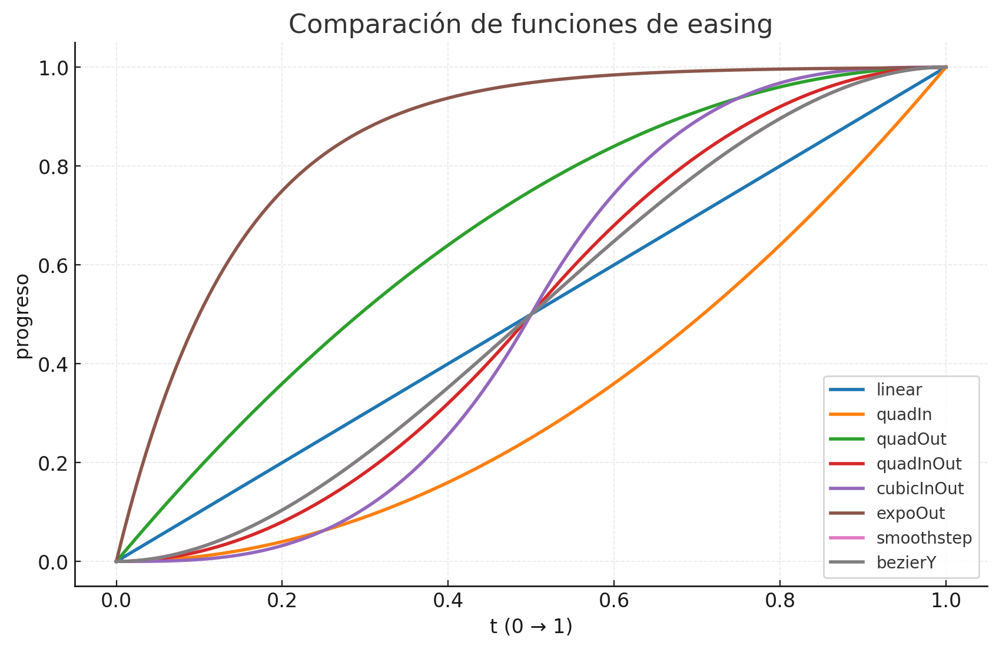

# Star Fields

Proyecto experimental en HTML, CSS y JavaScript que simula un viaje espacial con estrellas, planetas y la Tierra en primer plano.  
Incluye animaciones, efectos visuales (atmósfera, nubes, reflejos) y control de audio.

## Características
- Campo de estrellas en movimiento (cercanas y lejanas).
- Aparición progresiva de Sol, Marte, Júpiter y Tierra.
- Tierra con nubes animadas, atmósfera y luna en órbita.
- Controles de reproducción: play/pause con clic, barra de progreso y volumen.
- Opción de pantalla completa.
- Música de fondo sincronizada con la duración del viaje.

## Tecnologías usadas
- **HTML5 Canvas** para renderizado.
- **TailwindCSS** para estilos rápidos de la interfaz.
- **JavaScript puro** para lógica del juego, animaciones y easing.

## Uso
1. Abrir el archivo `index.html` en un navegador moderno.
2. Clic en la pantalla para pausar/reanudar.
3. Usar los controles inferiores para manejar audio, volumen, tiempo y fullscreen.

## Estructura de assets
- `./assets/img/earth.png` → Sprite de la Tierra
- `./assets/img/cloud.png` → Capa de nubes
- `./assets/img/cloud2.png` → Nubes invertidas
- `./assets/img/moon.png` → Sprite de la Luna
- `./assets/audio/song.m4a` → Música de fondo

## Easing Functions
El proyecto utiliza diferentes funciones de easing para suavizar transiciones entre posiciones y escalas de los planetas:

- **linear** → Movimiento uniforme.
- **quadIn, quadOut, quadInOut** → Aceleraciones y desaceleraciones cuadráticas.
- **cubicInOut** → Transiciones más suaves al inicio y final.
- **expoOut** → Rápido al inicio, suave al final.
- **smoothstep** → Fluido y natural, sin esquinas bruscas.
- **bezierY** → Permite curvas personalizadas mediante parámetros Bézier.

